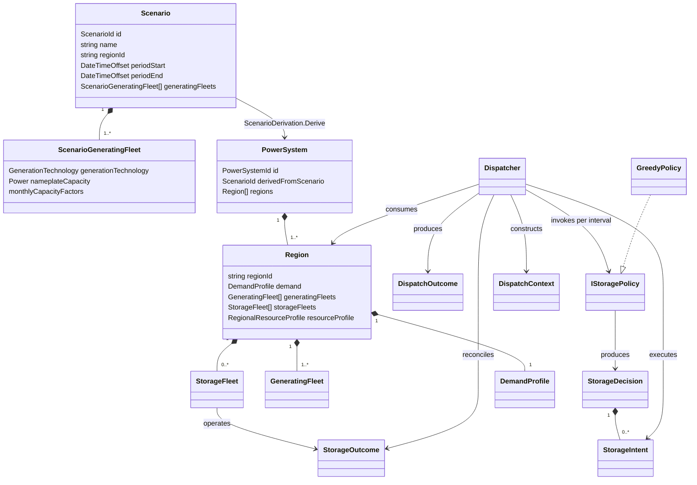

# Domain model

This document tracks the domain types currently implemented in `NEM.Model`.
It describes code that exists now; future concepts belong here only when their
domain types and invariants are implemented.



## Ownership boundaries

- `Scenario` is the aggregate root for scenario intent. It validates identity,
  NEM-time period bounds, target region, and generating-fleet plans.
- `ScenarioDerivation` is a pure domain service that realises a `PowerSystem`
  from scenario intent and aligned demand/resources. Scenario intent currently
  defines generating fleets only; storage fleets can be attached directly to a
  realised `Region` but are not yet produced by scenario derivation.
- `PowerSystem` is the realised grid aggregate and cites its source scenario by
  `ScenarioId`. It owns one or more `Region` aggregates.
- `Region` requires one or more generating fleets with distinct generation
  technologies and may own storage fleets with distinct storage technologies.
- `Dispatcher` remains scenario-blind. It consumes a realised `Region`, builds
  an immutable storage-policy context for each interval, executes policy intent
  through fleet physics, and produces a `DispatchOutcome`.
- `IStoragePolicy` owns storage intent and fleet ordering. It receives scalar
  snapshots rather than mutable fleet objects and does not own state of charge,
  execute storage physics, or book unserved demand and curtailment.
- Exported run results cite scenario and power-system identities rather than
  serialising the domain object graph.

## Input provenance

Demand and weather paths are CLI configuration used to locate inputs; they are
not part of `Scenario` identity. A result records the filename, input schema
version, and SHA-256 digest of the exact bytes parsed for each input. The digest
is the reproducibility boundary when a configured path is later overwritten.

The upstream demand archive names remain descriptive provenance from the demand
artifact. They do not replace the demand artifact digest.

## Time and units

Scenario periods and model series use fixed NEM market time (UTC+10). Result
generation timestamps use UTC because they describe when an artifact was
created; seeing `+10:00` period bounds and a `+00:00` generated timestamp in the
same result is intentional.

Flow series are interval-average MW and integrate to MWh through
`FlowSeries.Integrate()`. The dispatch invariant is:

```text
generation + discharge + imports + unserved
    = demand + charge + exports + curtailment
```

The current single-region model sets imports and exports to zero. A region
without storage also sets charge and discharge to zero. The current published
result JSON has no storage, so `generation - curtailment` is generation
delivered to load and uses the reduced identity:

```text
delivered generation + unserved = demand
```

With storage, `generation - curtailment` can also include generation diverted
to charging. Load served is then `demand - unserved`, and publishing a storage
run requires charge and discharge series alongside generation and curtailment
to preserve the full dispatch identity.

Reliability reports both unserved energy (USE) as a percentage of demand and
hours served. USE percentage is the binding reliability measure; hours served
is diagnostic and must not be compared with an energy-based reliability target.

## Storage

`StorageFleet` is an immutable storage-archetype configuration and an interval
state-transition operation. A positive requested flow discharges to the grid;
a negative requested flow charges from the grid. Its state of charge is always
validated within zero and its configured energy capacity.

Each fleet owns its energy and power capacities; its duration is derived as MWh
divided by MW. The same storage abstraction supports battery and pumped-hydro
fleets with different fleet capacities. Both limits bind each interval.

The technology profile supplies one round-trip efficiency. It is applied once
while charging: input MWh multiplied by efficiency becomes stored MWh.
Discharge removes and delivers stored MWh one-for-one, so a charge-discharge
cycle loses `(1 - efficiency)` of the grid energy used to charge it. Round-trip
efficiency is constrained to the inclusive range from zero to one.

`Dispatcher` initializes each storage fleet at zero MWh for a dispatch run and
threads the returned state of charge into the next interval. It constructs a
fresh `DispatchContext` after generation has been dispatched to demand and
before storage operates. The context contains signed residual power, resolution,
storage levels and operating headroom, and current incremental-generation
headroom. Positive residual means unmet demand; negative residual means
would-be-curtailed surplus.

`GreedyPolicy` is stateless. For a deficit it requests discharge; for a surplus
it requests charging sourced only from that surplus. It allocates Battery before
PumpedHydro and limits intent using the headroom snapshots. The fleet still
clamps every request and remains the authority for power limits, energy limits,
and round-trip loss.

A policy returns one `StorageDecision` per interval. The decision contains zero
or more `StorageIntent` values, each targeting one storage technology with a
requested MW flow and, for charging, its energy source. The dispatcher processes
the intents in order. Each executable intent invokes that fleet's `Operate`
transition and produces a separate `StorageOutcome` containing actual delivered
MW and final state of charge. An intent can be skipped without an outcome when
no deficit, surplus, or incremental-generation headroom remains. Outcomes are
therefore per-fleet state transitions, not a collection attached to the policy
decision; the dispatcher aggregates their actual flows into `DispatchOutcome`.

The dispatcher reconciles actual flow rather than requested flow. Remaining
demand deficit becomes unserved energy, while unused surplus becomes
curtailment. Partial or rejected charging is silent: it does not create unserved
energy or cost. Charging is recorded as non-negative surplus-sourced and
incremental-generation-sourced series whose sum is total charge. An
incremental-generation intent identifies the generation technology, and
accepted charging consumes that fleet's current capacity and monthly
energy-budget headroom.

The policy context contains current-interval information only. It can support a
policy that charges from current excess generation capacity, but it cannot
support pre-charging in anticipation of future residual demand because no
forward residual series is provided.