# Domain model

This document tracks the domain types currently implemented in `NEM.Model`.
It describes code that exists now; future concepts belong here only when their
domain types and invariants are implemented.

```mermaid
classDiagram
    class Scenario {
        ScenarioId id
        string name
        DateTimeOffset periodStart
        DateTimeOffset periodEnd
        ScenarioRegion[] regions
      CostBasis costBasis
    }
    class ScenarioRegion {
        string regionId
        ScenarioGeneratingFleet[] generatingFleets
      ScenarioStorageFleet[] storageFleets
    }
      class ScenarioGeneratingFleet {
        GenerationTechnology generationTechnology
        Power nameplateCapacity
        GenerationCostParameters costParameters
        GenerationTechnologyProfile technologyProfile
        monthlyCapacityFactors
    }
    class CostBasis {
      int year
      decimal realDiscountRate
    }
      class GenerationCostParameters {
      PowerCapacityCost capitalCost
      AnnualPowerCapacityCost fixedOperatingCost
        GenerationEnergyCost variableOperatingCost
      FuelPrice fuelPrice
    }
    class GenerationTechnologyProfile {
      HeatRate heatRate
      uint technicalLifeYears
    }
    class ScenarioStorageFleet {
      StorageTechnology storageTechnology
      Energy initialEnergyCapacity
      Power initialPowerCapacity
      StorageCostParameters costParameters
      StorageTechnologyProfile technologyProfile
    }
    class StorageCostParameters {
      PowerCapacityCost powerCapitalCost
      EnergyCapacityCost energyCapitalCost
      AnnualPowerCapacityCost fixedOperatingCost
    }
    class StorageTechnologyProfile {
      uint technicalLifeYears
      double roundTripEfficiency
    }
    class PowerSystem {
        PowerSystemId id
        ScenarioId derivedFromScenario
        Region[] regions
    }
    class Region {
        string regionId
        DemandProfile demand
        GeneratingFleet[] generatingFleets
        StorageFleet[] storageFleets
        StorageTechnologyProfile[] storageTechnologyProfiles
        RegionalResourceProfile resourceProfile
    }
    class DispatchOutcome
    class ReliabilityMetrics
    class IStoragePolicy
    class GreedyPolicy
    class DispatchContext
    class StorageDecision
    class StorageIntent
    class StorageOutcome
    class RegionalDispatchRun
    class GenerationBudgetState
    class StorageSizingService
    class StorageSizingRunResult
    class RegionalSizingResult
    class RegionalBatterySizing
    class InstalledBatteryAssessment

    Scenario "1" *-- "1..*" ScenarioRegion
    Scenario "1" *-- "1" CostBasis
    ScenarioRegion "1" *-- "1..*" ScenarioGeneratingFleet
    ScenarioRegion "1" *-- "0..*" ScenarioStorageFleet
    ScenarioGeneratingFleet "1" *-- "1" GenerationCostParameters
    ScenarioGeneratingFleet "1" *-- "1" GenerationTechnologyProfile
    ScenarioStorageFleet "1" *-- "1" StorageCostParameters
    ScenarioStorageFleet "1" *-- "1" StorageTechnologyProfile
    Scenario --> PowerSystem : ScenarioDerivation.Derive
    PowerSystem "1" *-- "1..*" Region
    Region "1" *-- "1..*" GeneratingFleet
    Region "1" *-- "0..*" StorageFleet
    Region "1" *-- "1" DemandProfile
    Dispatcher --> PowerSystem : consumes
    Dispatcher --> RegionalDispatchRun : creates per region
    RegionalDispatchRun --> GenerationBudgetState : owns per fleet
    Dispatcher --> IStoragePolicy : invokes per interval
    Dispatcher --> DispatchContext : constructs
    IStoragePolicy --> StorageDecision : produces
    StorageDecision "1" *-- "0..*" StorageIntent
    GreedyPolicy ..|> IStoragePolicy
    Dispatcher --> StorageIntent : executes
    StorageFleet --> StorageOutcome : operates
    Dispatcher --> StorageOutcome : reconciles
    Dispatcher "1" --> "1..*" DispatchOutcome : produces per region
    DispatchOutcome "1" *-- "1" ReliabilityMetrics
    StorageSizingService --> PowerSystem : sizes immutable candidates
    StorageSizingService --> Dispatcher : reruns whole system
    StorageSizingService --> StorageSizingRunResult : produces
    StorageSizingRunResult "1" *-- "1..*" RegionalSizingResult
    StorageSizingRunResult "1" *-- "1..*" InstalledBatteryAssessment
    RegionalSizingResult "1" *-- "1" RegionalBatterySizing
    RegionalSizingResult --> DispatchOutcome : final evidence
    InstalledBatteryAssessment --> DispatchOutcome : installed-capacity evidence
    InstalledBatteryAssessment "1" *-- "1" RegionalBatterySizing
```



## Ownership boundaries

- `Scenario` is the aggregate root for scenario intent. It validates identity,
  NEM-time period bounds, cost basis, and distinct regional fleet plans.
- `ScenarioRegion` owns region-specific generation and storage fleet plans. It
  requires distinct technologies within each collection, while the same
  technology may appear with different capacity in another scenario region.
- `CostBasis` fixes the year and real discount rate applied to scenario costs.
  `RealDiscountRate` is a `decimal`, and generation technical life is a `uint`.
  Each `ScenarioGeneratingFleet` owns its `GenerationCostParameters` and a
  `GenerationTechnologyProfile`. Generation cost parameters contain only power
  capital cost, annual fixed OPEX, variable operating cost in AUD/MWh generated,
  and fuel price. They do not contain storage energy capital cost.
- Each `ScenarioStorageFleet` owns initial MW and MWh plus
  `StorageCostParameters`: power capex in AUD/MW, energy capex in AUD/MWh of
  storage capacity, and fixed OPEX in AUD/MW/year. It also owns a
  `StorageTechnologyProfile` containing technical life and round-trip efficiency.
  Initial MW and MWh must either both be zero or both be positive. A zero-capacity
  plan carries both economic and technical assumptions for Battery capacity later
  introduced by `StorageSizingService`.
- `ScenarioDerivation` is a pure domain service that realises a `PowerSystem`
  from scenario intent plus one aligned demand series per scenario region,
  optional aligned additive demand components, and optional aligned regional
  resource profiles. It realises positive-capacity storage plans and omits
  zero-capacity sizing plans. Realised `StorageFleet`
  values retain their scenario technology profiles. `Region` also retains the
  profile map for zero-capacity plans, so immutable sizing candidates use each
  region's assumptions without making sizing scenario-aware. Its
  `ScenarioGeneratingFleet.ToGeneratingFleet` transformation derives typed
  short-run marginal cost as variable operating cost plus fuel price multiplied
  by heat rate. The realised `GeneratingFleet` owns that dispatch-relevant value.
- `DataCentreDemand` expands a validated nameplate into a flat,
  full-load-factor component for the scenario period.
- `PowerSystem` is the realised grid aggregate and cites its source scenario by
  `ScenarioId`. It owns one or more `Region` aggregates.
- `Region` requires one or more generating fleets with distinct generation
  technologies and may own storage fleets with distinct storage technologies.
  Its `DemandProfile` owns the base demand and zero or more labelled
  `DemandComponent` flows. Components must be non-negative, uniquely named
  case-insensitively, and exactly aligned with base demand; total demand is their
  element-wise sum and is the only demand consumed by dispatch.
- `Dispatcher` remains scenario-blind. It consumes a realised `PowerSystem` and
  dispatches each owned region, producing one `DispatchOutcome` per region. Each
  outcome includes its `ReliabilityMetrics`. A per-region `RegionalDispatchRun`
  owns mutable execution state, including generation budgets and storage levels.
  It orders generating fleets by short-run marginal cost and then technology for
  deterministic ties, builds an immutable storage-policy context for each
  interval, and executes policy intent through fleet physics.
- `IStoragePolicy` owns storage intent and fleet ordering. It receives scalar
  snapshots rather than mutable fleet objects and does not own state of charge,
  execute storage physics, or book unserved demand and curtailment.
- `StorageSizingService` is a pure whole-system orchestration service. It creates
  immutable `PowerSystem` candidates, reruns dispatch, and changes Battery
  storage only in regions that fail the configured USE target. Pumped hydro is
  fixed. Existing Battery capacity is the starting lower bound and results report
  total Battery capacity rather than incremental capacity.
- `StorageSizingRunResult` validates that its regional results correspond exactly
  to final `PowerSystem` regions, their generation technologies match the final
  system fleets, and their dispatch timelines align with the final system demand.
- `PowerSystemCostCalculator` calculates a `PowerSystemCostBreakdown` after
  validating scenario, realised system, and dispatch correspondence. It requires
  exactly one scenario year. For each generation fleet it adds annualised power
  capex, one year of fixed OPEX, variable OPEX on gross generated energy, and
  fuel cost on gross generated energy. For every final realised storage fleet,
  it annualises combined power and energy capex over that technology's technical
  life and adds one year of fixed power OPEX. This costs total final capacity,
  including capacity introduced by sizing, and rejects storage without matching
  scenario assumptions. It sums `DispatchOutcome.DeliveredToLoad` and divides
  each component and their reconciled total once by total served energy.
  `PowerSystemCostBreakdown` is a value-only result, not a calculation service.
  Transmission remains an explicit zero placeholder.
- Exported run results cite scenario and power-system identities rather than
  serialising the domain object graph.

## Input provenance

Demand and weather paths are CLI configuration used to locate inputs; they are
not part of `Scenario` identity. A result records the filename, input schema
version, and SHA-256 digest of the exact bytes parsed for each input. The digest
is the reproducibility boundary when a configured path is later overwritten.

The upstream demand archive names remain descriptive provenance from the demand
artifact. They do not replace the demand artifact digest.

## Time and units

Scenario periods and model series use fixed NEM market time (UTC+10). Result
generation timestamps use UTC because they describe when an artifact was
created; seeing `+10:00` period bounds and a `+00:00` generated timestamp in the
same result is intentional.

Money and cost-rate quantities use `decimal`; measured physical quantities use
`double`. They meet only inside typed conversion methods, where finite,
non-negative physical values are explicitly converted to `decimal`. `Money`
divided by energy served to load produces `EnergyPrice` in AUD/MWh served.
`GenerationEnergyCost` is AUD/MWh generated and is used for variable operating
and fuel-derived costs on gross generation. `FuelPrice` multiplied by heat rate
produces a `GenerationEnergyCost`. `EnergyCapacityCost` is one-time AUD/MWh of
storage capacity and produces `Money` only when multiplied by storage `Energy`.

`PowerSystemCostBreakdown` retains delivered energy separately from annual
generation and storage costs. Its denominator is total
`DispatchOutcome.DeliveredToLoad`, not per-fleet generation allocation. Storage
asset cost does not add charging energy: gross generation VOM and fuel already
price generation used for charging and therefore include storage losses. The
storage component is annualised storage asset cost divided by the same served
energy denominator; it is not a standalone LCoS. These costs are modelled
estimates, not audited figures; `decimal` prevents base-10 accumulation
artefacts from appearing as model defects.

Flow series are interval-average MW and integrate to MWh through
`FlowSeries.Integrate()`. The dispatch invariant is:

```text
generation + discharge + imports + unserved
    = demand + charge + exports + curtailment
```

`DispatchOutcome.DeliveredToLoad` is `demand - unserved`; it is the regional
load served by generation, storage discharge, and imports, and is the SLCoE
denominator. Storage charging is recorded only as total `charge`; dispatch
evidence does not retain a surplus-versus-incremental-generation source split.

Per-fleet delivered and charge series are consistent bookkeeping allocations,
not physical attributions. `RegionalDispatchRun` produces these allocations
as storage operations execute; `DispatchOutcome` stores the supplied immutable
series and enforces their invariants. Surplus charging is booked to each fleet
by the amount its curtailment is reduced, following dispatch merit order.
Incremental-generation charging is booked to its named source fleet. Per-fleet
delivered generation is the remainder after curtailment and charge. These rules
close each interval exactly without reconstructing allocations from regional
totals. The resulting per-fleet identity is:

```text
fleet generation = fleet curtailment + allocated fleet charge
  + allocated generator-supplied load
```

Generator-supplied load sums to `deliveredToLoad - discharge - imports +
exports`, while allocated fleet charge sums to regional `charge`. This
distinction is necessary because storage discharge and imports serve load but
are not current-interval generation by any generating fleet.

The current single-region model sets imports and exports to zero. A region
without storage also sets charge and discharge to zero. The current published
result JSON has no storage, so `generation - curtailment` is generation
delivered to load and uses the reduced identity:

```text
delivered generation + unserved = demand
```

With storage, `generation - curtailment` can also include generation diverted
to charging. Load served is then `demand - unserved`, and publishing a storage
run requires charge and discharge series alongside generation and curtailment
to preserve the full dispatch identity.

Reliability reports both unserved energy (USE) as a percentage of demand and
hours served, plus peak single-hour unserved power. USE percentage is the binding
reliability measure; hours served and peak unserved are diagnostics and must not
be compared directly with an energy-based reliability target.

## Storage sizing

Storage sizing defaults to the NER target of 0.002% USE. A caller supplies a
commercial maximum Battery power, maximum Battery energy, and pass bound. New
or undersized Battery storage is first raised to 30 MW and 120 MWh. Every sized
candidate preserves a minimum four-hour duration.

After the floor, total USE divided by current Battery energy and peak unserved
power divided by current Battery power steer monotone geometric growth. Storage
dispatch is stepwise, so increasing a dimension can plateau but must not increase
USE. Explicit MW, MWh, and pass bounds provide termination; reaching a capacity
bound returns `BatteryCapacityLimitReached`, while exhausting dispatch passes
returns `PassLimitReached`.

Once every region complies, full-system probes refine power and energy to 1 MW
and 1 MWh precision while retaining only compliant candidates. The result is a
deterministic coordinate-wise near-frontier point, not a globally minimum or
cost-optimal point. Multi-region orchestration is implemented, but regions remain
independent until interconnectors are introduced.

## Storage

`StorageFleet` is an immutable storage-archetype configuration and an interval
state-transition operation. A positive requested flow discharges to the grid;
a negative requested flow charges from the grid. Its state of charge is always
validated within zero and its configured energy capacity.

Each fleet owns its energy and power capacities; its duration is derived as MWh
divided by MW. The same storage abstraction supports battery and pumped-hydro
fleets with different fleet capacities. Both limits bind each interval.

Each scenario storage plan supplies a technology profile; there are no
technology-name defaults in the domain. A realised fleet retains that profile.
Its round-trip efficiency is applied once
while charging: input MWh multiplied by efficiency becomes stored MWh.
Discharge removes and delivers stored MWh one-for-one, so a charge-discharge
cycle loses `(1 - efficiency)` of the grid energy used to charge it. Round-trip
efficiency is constrained to the inclusive range from zero to one.

`Dispatcher` initializes each storage fleet at zero MWh for a dispatch run and
threads the returned state of charge into the next interval. `DispatchOutcome`
records one interval-beginning `StockSeries` per storage technology. The
dispatcher constructs a fresh `DispatchContext` after generation has been
dispatched to demand and before storage operates. The context contains signed
residual power, resolution, storage levels and operating headroom, and current
incremental-generation headroom. Positive residual means unmet demand; negative
residual means would-be-curtailed surplus.

`GreedyPolicy` is stateless. For a deficit it requests discharge; for a surplus
it requests charging sourced only from that surplus. It allocates Battery before
PumpedHydro and limits intent using the headroom snapshots. The fleet still
clamps every request and remains the authority for power limits, energy limits,
and round-trip loss.

A policy returns one `StorageDecision` per interval. The decision contains zero
or more `StorageIntent` values, each targeting one storage technology with a
requested MW flow and, for charging, its energy source. The dispatcher processes
the intents in order. Each executable intent invokes that fleet's `Operate`
transition and produces a separate `StorageOutcome` containing actual delivered
MW and final state of charge. An intent can be skipped without an outcome when
no deficit, surplus, or incremental-generation headroom remains. Outcomes are
therefore per-fleet state transitions, not a collection attached to the policy
decision; the dispatcher aggregates their actual flows into `DispatchOutcome`.

The dispatcher reconciles actual flow rather than requested flow. Remaining
demand deficit becomes unserved energy, while unused surplus becomes
curtailment. Partial or rejected charging is silent: it does not create unserved
energy or cost. Charging is recorded as non-negative surplus-sourced and
incremental-generation-sourced series whose sum is total charge. An
incremental-generation intent identifies the generation technology, and
accepted charging consumes that fleet's current capacity and monthly
energy-budget headroom.

The policy context contains current-interval information only. It can support a
policy that charges from current excess generation capacity, but it cannot
support pre-charging in anticipation of future residual demand because no
forward residual series is provided.