# Domain model

This document tracks the domain types in `NEMSweep.Model`, the framework. It
describes the code as it is. The framework does not hardcode the National
Electricity Market's region list or couple to AEMO: region identifiers are
free-form strings. Its grid model runs on a fixed one-hour timestep. The
market-time offset is a run parameter, taken from the scenario period bounds
(`Scenario.MarketTimeOffset`, validated by `MarketTime`) and defaulting to the
NEM's UTC+10; every series in a run shares it.

```mermaid
classDiagram
    class Scenario {
        ScenarioId id
        string name
        DateTimeOffset periodStart
        DateTimeOffset periodEnd
        ScenarioRegion[] regions
      CostBasis costBasis
    }
    class ScenarioRegion {
        string regionId
        ScenarioGeneratingFleet[] generatingFleets
      ScenarioStorageFleet[] storageFleets
    }
    class ScenarioInterconnector {
      string fromRegionId
      string toRegionId
      Power capacity
      TransmissionCostParameters costParameters
      uint technicalLifeYears
    }
    class TransmissionCostParameters {
      DistancePowerCost capitalCost
      AnnualDistancePowerCost fixedOperatingCost
    }
    class ScenarioGeneratingFleet {
      GenerationTechnology generationTechnology
      Power nameplateCapacity
      GenerationCostParameters costParameters
      GenerationTechnologyProfile technologyProfile
        monthlyCapacityFactors
    }
    class CostBasis {
      int year
      decimal realDiscountRate
    }
      class GenerationCostParameters {
      PowerCapacityCost capitalCost
      AnnualPowerCapacityCost fixedOperatingCost
        GenerationEnergyCost variableOperatingCost
      FuelPrice fuelPrice
    }
    class GenerationTechnologyProfile {
      HeatRate heatRate
      uint technicalLifeYears
      GenerationEmissionsIntensity emissionsIntensity
    }
    class ScenarioStorageFleet {
      StorageTechnology storageTechnology
      Energy initialEnergyCapacity
      Power initialPowerCapacity
      StorageCostParameters costParameters
      StorageTechnologyProfile technologyProfile
    }
    class StorageCostParameters {
      PowerCapacityCost powerCapitalCost
      EnergyCapacityCost energyCapitalCost
      AnnualPowerCapacityCost fixedOperatingCost
    }
    class StorageTechnologyProfile {
      uint technicalLifeYears
      double roundTripEfficiency
    }
    class PowerSystem {
        PowerSystemId id
        ScenarioId derivedFromScenario
        Region[] regions
    }
    class Region {
        string regionId
        DemandProfile demand
        GeneratingFleet[] generatingFleets
        StorageFleet[] storageFleets
        StorageTechnologyProfile[] storageTechnologyProfiles
        RegionalResourceProfile resourceProfile
    }
    class DispatchOutcome
    class SystemDispatchOutcome
    class InterconnectorFlow
    class ReliabilityMetrics
    class SystemReliabilityAssessment
    class RegionReliabilityVerdict
    class IStoragePolicy
    class GreedyPolicy
    class GreedySurplusAndIncrementalGenerationChargingPolicy
    class DispatchContext
    class StorageDecision
    class StorageIntent
    class StorageOutcome
    class SystemDispatchRun
    class RegionalDispatchRun
    class GenerationBudgetState
    class StorageSizingService
    class StorageSizingRunResult
    class RegionalSizingResult
    class RegionalBatterySizing
    class InstalledBatteryAssessment
    class EnergyLimitedAssessment

    Scenario "1" *-- "1..*" ScenarioRegion
    Scenario "1" *-- "0..*" ScenarioInterconnector
    ScenarioInterconnector "1" *-- "1" TransmissionCostParameters
    Scenario "1" *-- "1" CostBasis
    ScenarioRegion "1" *-- "1..*" ScenarioGeneratingFleet
    ScenarioRegion "1" *-- "0..*" ScenarioStorageFleet
    ScenarioGeneratingFleet "1" *-- "1" GenerationCostParameters
    ScenarioGeneratingFleet "1" *-- "1" GenerationTechnologyProfile
    ScenarioStorageFleet "1" *-- "1" StorageCostParameters
    ScenarioStorageFleet "1" *-- "1" StorageTechnologyProfile
    Scenario --> PowerSystem : ScenarioDerivation.Derive
    PowerSystem "1" *-- "1..*" Region
    PowerSystem "1" *-- "0..*" Interconnector
    Region "1" *-- "1..*" GeneratingFleet
    Region "1" *-- "0..*" StorageFleet
    Region "1" *-- "1" DemandProfile
    Dispatcher --> PowerSystem : consumes
    Dispatcher --> SystemDispatchRun : delegates the horizon
    SystemDispatchRun --> RegionalDispatchRun : creates per region
    RegionalDispatchRun --> GenerationBudgetState : owns per fleet
    Dispatcher --> IStoragePolicy : invokes per interval
    Dispatcher --> DispatchContext : constructs
    IStoragePolicy --> StorageDecision : produces
    StorageDecision "1" *-- "0..*" StorageIntent
    GreedyPolicy ..|> IStoragePolicy
    GreedySurplusAndIncrementalGenerationChargingPolicy ..|> IStoragePolicy
    Dispatcher --> StorageIntent : executes
    StorageFleet --> StorageOutcome : operates
    Dispatcher --> StorageOutcome : reconciles
    Dispatcher "1" --> "1..*" DispatchOutcome : produces per region
    SystemDispatchOutcome "1" *-- "0..*" InterconnectorFlow : solver evidence
    DispatchOutcome "1" *-- "1" ReliabilityMetrics
    SystemDispatchOutcome --> PowerSystem : validates correspondence
    SystemDispatchOutcome "1" *-- "1..*" DispatchOutcome : aggregates regional evidence
    SystemDispatchOutcome "1" *-- "1" ReliabilityMetrics
    SystemReliabilityAssessment --> SystemDispatchOutcome : assesses
    SystemReliabilityAssessment "1" *-- "1..*" RegionReliabilityVerdict
    StorageSizingService --> PowerSystem : sizes immutable candidates
    StorageSizingService --> Dispatcher : reruns whole system
    StorageSizingService --> StorageSizingRunResult : produces
    StorageSizingRunResult "1" *-- "1..*" RegionalSizingResult
    StorageSizingRunResult "1" *-- "1..*" InstalledBatteryAssessment
    StorageSizingRunResult "1" *-- "0..*" InterconnectorFlow : final evidence
    StorageSizingRunResult "1" --> "0..1" EnergyLimitedAssessment : system evidence
    RegionalSizingResult "1" *-- "1" RegionalBatterySizing
    RegionalSizingResult --> DispatchOutcome : final evidence
    InstalledBatteryAssessment --> DispatchOutcome : installed-capacity evidence
    InstalledBatteryAssessment "1" *-- "1" RegionalBatterySizing
```



## Ownership boundaries

- `Scenario` is the aggregate root for scenario intent. It validates identity,
  NEM-time period bounds, cost basis, and distinct regional fleet plans.
- `ScenarioRegion` owns region-specific generation and storage fleet plans. It
  requires distinct technologies within each collection, while the same
  technology may appear with different capacity in another scenario region.
- `CostBasis` fixes the year and real discount rate applied to scenario costs.
  `RealDiscountRate` is a `decimal`, and generation technical life is a `uint`.
  Each `ScenarioGeneratingFleet` owns its `GenerationCostParameters` and a
  `GenerationTechnologyProfile`. Generation cost parameters contain only power
  capital cost, annual fixed OPEX, variable operating cost in AUD/MWh generated,
  and fuel price. They do not contain storage energy capital cost. The technology
  profile holds the fleet's physical per-MWh-generated assumptions: heat rate,
  technical life, and emissions intensity in t CO2-e/MWh generated. There is no
  technology-name default for any of them, so a non-emitting fleet declares a zero
  intensity rather than inheriting one.
- Each `ScenarioStorageFleet` owns initial MW and MWh plus
  `StorageCostParameters`: power capex in AUD/MW, energy capex in AUD/MWh of
  storage capacity, and fixed OPEX in AUD/MW/year. It also owns a
  `StorageTechnologyProfile` containing technical life and round-trip efficiency.
  Initial MW and MWh must either both be zero or both be positive. A zero-capacity
  plan carries both economic and technical assumptions for Battery capacity later
  introduced by `StorageSizingService`.
- `ScenarioDerivation` is a pure domain service that realises a `PowerSystem`
  from scenario intent plus one aligned demand series per scenario region,
  optional aligned additive demand components, and optional aligned regional
  resource profiles. It realises positive-capacity storage plans and omits
  zero-capacity sizing plans. Realised `StorageFleet`
  values retain their scenario technology profiles. `Region` also retains the
  profile map for zero-capacity plans, so immutable sizing candidates use each
  region's assumptions without making sizing scenario-aware. Its
  `ScenarioGeneratingFleet.ToGeneratingFleet` transformation derives typed
  short-run marginal cost as variable operating cost plus fuel price multiplied
  by heat rate. The realised `GeneratingFleet` owns that dispatch-relevant value.
- `DataCentreDemand` expands a validated nameplate into a flat,
  full-load-factor component for the scenario period.
- `PowerSystem` is the realised grid aggregate and cites its source scenario by
  `ScenarioId`. It owns one or more `Region` aggregates and zero or more
  `Interconnector` values.
- `Interconnector` is owned by `PowerSystem`, not by either endpoint, because it
  belongs to neither region alone. It holds one directed transfer capacity from
  `FromRegionId` to `ToRegionId`, metered at the sending end, and endpoints
  identified by the same bare region strings compared case-insensitively that are
  used everywhere else. A reciprocal path is a separate interconnector.
  `PowerSystem` requires both endpoints to be its own regions and permits at most
  one interconnector per exact direction. `WithRegions` forwards the collection,
  so the repeated region rebuilds performed by storage sizing cannot silently drop
  links. `ScenarioInterconnector` is the matching intent, hung off `Scenario`
  alongside `CostBasis` because it is cross-regional, and it carries
  `TransmissionCostParameters` and a technical life for that directed capacity.
  `TransmissionCostParameters` costs a line in AUD/km/MW capex
  (`DistancePowerCost`) and AUD/km/MW/year fixed opex
  (`AnnualDistancePowerCost`): a line's cost scales with both route length and
  transfer capacity. There is no variable term.
- `Region` requires one or more generating fleets with distinct generation
  technologies and may own storage fleets with distinct storage technologies.
  Its `DemandProfile` owns the base demand and zero or more labelled
  `DemandComponent` flows. Components must be non-negative, uniquely named
  case-insensitively, and exactly aligned with base demand; total demand is their
  element-wise sum and is the only demand consumed by dispatch.
- `Dispatcher` remains scenario-blind. It consumes a realised `PowerSystem` and
  dispatches each owned region, producing one `DispatchOutcome` per region. Each
  outcome includes its `ReliabilityMetrics`. A per-region `RegionalDispatchRun`
  owns mutable execution state, including generation budgets and storage levels.
  It orders generating fleets by short-run marginal cost, then by technology to
  break ties deterministically (`GenerationMeritOrder`); conventional Hydro sorts
  into this order like any other technology and is not excluded from it. Unlike
  every other technology it carries a monthly energy budget (`GenerationBudgetState`)
  rather than a fuel cost, so 90% of that budget (the "paced" pool) is
  metered by `HydroReservationState`: a causal threshold controller that caps
  Hydro's request each interval at `max(0, residualDemand - T)`, where T is
  solved by bisection each interval so that, applied over a trailing 336-interval
  window of past residual-demand observations, it would have spent exactly the
  budget affordable per interval over the intervals left in the month. This
  self-calibrates to whatever the demand distribution looks like. A sort-based
  "dispatch last" rule tried first stranded roughly 93% of the budget instead of
  rationing it (NEM-076). The remaining 10% (the "reserve" pool) is held
  back entirely from normal merit-order dispatch and spent only by
  `RegionalDispatchRun.DispatchHydroFallback`, a true last-resort backstop that
  runs after that region's own storage, against whatever local deficit storage
  could not cover. Neither pool carries into the next month, so once less than
  three days of the month remain the unspent reserve is released into the paced
  pool (`GenerationBudgetState.ReleaseUnspentReserve`): past that point holding it
  no longer buys cover, it only guarantees the energy expires unused. Both the
  paced cap and the release are settled once per interval in
  `BeginInterval`, so local dispatch, exports, and storage charging all price
  Hydro against the same allowance. `RegionalDispatchRun` builds an immutable
  storage-policy context for each interval, and executes policy intent through
  fleet physics.
- `SystemDispatchRun` owns the horizon. The **interval is the outer loop and the
  region the inner loop**, so every region is at the same hour at the same time
  and surplus in one can serve a deficit in another. Order within an interval is
  generation (including Hydro's paced share, in normal merit-order position),
  then inter-regional transfer, then storage. Immediately after that region's own
  storage comes that region's own Hydro reserve fallback, which is strictly local
  and never visible to transfer. Each region's own sequence of
  operations is otherwise unchanged by the inversion, so a system with no
  interconnectors produces results identical to dispatching each region alone.
- `InterRegionalTransfer` is the only place the domain meets the graph. It maps
  regional surplus and deficit onto nodes, delegates to the pure algorithms in
  `NEMSweep.Model/Algorithms`, and books deliveries back as imports and exports. The
  algorithm layer knows nothing of regions, power, or losses; the transfer layer
  knows nothing of how maximum flow is found. Losses are applied over the result,
  never inside the search, which is what keeps it a standard max-flow problem.
  Exports draw on curtailment first and then start dispatchable plant in merit
  order; pumped hydro is excluded because storage is decided after transfer.
  Conventional Hydro is not excluded. Its incremental headroom for an export is
  capped to the same per-interval pace as local dispatch (see
  `RegionalDispatchRun.IncrementalHeadroom`), so an export can substitute for
  local demand this interval but never draws on budget paced for a future local
  peak. Hydro's reserve share is never exportable at all: it is reachable only
  from `DispatchHydroFallback`, after transfer has already run for the interval.
- `IStoragePolicy` owns storage intent and fleet ordering. It receives scalar
  snapshots rather than mutable fleet objects and does not own state of charge,
  execute storage physics, or book unserved demand and curtailment.
- `SystemDispatchOutcome` is immutable whole-system dispatch evidence. Its factory
  requires exactly one hourly `DispatchOutcome` per `PowerSystem` region and checks
  every regional demand timeline. An unlinked system rejects nonzero regional
  import/export boundaries; a linked system must be created from
  `SystemDispatchRunResult` solver evidence, whose interconnector losses reconcile
  with regional exports less imports. `InterconnectorFlow` stores one non-negative
  directed `Flow` series from the link's sending region and a loss series no greater
  than that flow. The aggregate sums common demand, residual, storage, and
  per-technology flow series element-wise, zero-fills technologies absent from a
  region, sums storage state of charge by technology, and recalculates served load
  and reliability from the resulting system series. It retains validated regional
  outcomes and directional link evidence as read-only export evidence.
- `SystemReliabilityAssessment` is immutable whole-system target evidence. Its
  factory compares the aggregate USE calculated by `SystemDispatchOutcome` and
  each retained regional `DispatchOutcome` against one maximum USE percentage.
  It passes only when the system measurement and every `RegionReliabilityVerdict`
  are within that target; system USE is calculated from aggregate demand and
  unserved energy, never by averaging regional percentages.
- `StorageSizingService` is a pure whole-system orchestration service. It creates
  immutable `PowerSystem` candidates, reruns dispatch, and changes Battery
  storage only in regions that fail the configured USE target. Pumped hydro is
  fixed. Existing Battery capacity is the starting lower bound and results report
  total Battery capacity rather than incremental capacity.
- `StorageSizingRunResult` validates that its regional results correspond exactly
  to final `PowerSystem` regions, their generation technologies match the final
  system fleets, and their dispatch timelines align with the final system demand.
  It also requires exactly one aligned `InterconnectorFlow` for every final link,
  matching endpoint order case-insensitively, directed capacity, and non-negative
  flow/loss values.
- `EmissionsCalculator` calculates an `EmissionsSummary` from the same scenario,
  realised system and dispatch evidence, after the same correspondence validation:
  `RealisedSystemCorrespondence` is shared by both accounting services, so a
  cost figure and an emissions figure can never be published against differently
  validated inputs. For each generation fleet it multiplies that fleet's
  `GenerationEmissionsIntensity` by its gross generated energy, exactly the basis
  the fuel term uses. It produces one `RegionEmissionsSummary` per region with
  total emissions and an intensity divided by that region's
  `DispatchOutcome.EnergyServed`, then re-aggregates system emissions by
  technology so the published contributions reconcile to the published total,
  independent of region iteration order. Scope is combustion during generation:
  storage and transmission assets have no emissions of their own, because the
  generation that charged a battery is already counted where it was generated.
  `EmissionsSummary` and `RegionEmissionsSummary` are value-only results, not
  calculation services.
- `PowerSystemCostCalculator` calculates a `PowerSystemCostBreakdown` after
  validating scenario, realised system, and dispatch correspondence. It requires
  exactly one scenario year. For each generation fleet it adds annualised power
  capex, one year of fixed OPEX, variable OPEX on gross generated energy, and
  fuel cost on gross generated energy. For every final realised storage fleet,
  it annualises combined power and energy capex over that technology's technical
  life and adds one year of fixed power OPEX. This costs total final capacity,
  including capacity introduced by sizing, and rejects storage without matching
  scenario assumptions. It produces one `RegionCostBreakdown` per region with
  annualised generation, storage, and total costs and each of their levelised
  costs divided by that region's `DispatchOutcome.EnergyServed`. It derives
  system annual costs and served energy from those regional values. System generation
  cost is deterministically re-aggregated by technology so the published technology
  contributions exactly reconcile to the published generation total, then the system
  components are divided once by total served energy.
  `PowerSystemCostBreakdown` and `RegionCostBreakdown` are value-only results,
  not calculation services. Transmission is annuitised from scenario directed
  interconnector cost assumptions and charged once at system level, so
  regional costs do not sum to the system total. Route length is a field
  declared directly on `ScenarioInterconnector` (`Distance RouteLength`),
  not derived from anything else, so `NEMSweep.Model.Economics` has no dependency
  on `NEMSweep.Model.Weather`: a scenario is fully specified economically without
  any interconnector endpoint needing weather data. A system result states
  whether transmission economics were calculated;
  regional results state that transmission is not modelled in their cost scope,
  even though they disclose incoming-link loss allocation.
- **Reciprocal links each carry the full route length** (see the
  `TransmissionCostParameters` remarks): every corridor is declared as two
  directed interconnectors, each costed independently at the corridor's full
  distance, so the same kilometre of conductor is paid for twice, once per
  direction. Charging each of the 5 physical corridors once at its larger
  directed rating gives 1,955,280 km·MW against the 3,461,890 km·MW actually
  charged across all 10 directed links, so this convention alone accounts for
  roughly 1.8× of the published transmission cost. This is kept deliberately
  rather than fixed: attributing a shared asset's cost to one direction over
  the other would need a convention of its own. Route length itself used to be
  derived as the great-circle distance between the endpoint regions' *solar*
  weather sites, which ran long against the real NEM corridors; the committed
  scenario now declares approximate real corridor distances instead (see
  [Limitations §6](assumptions/limitations.md#6-reciprocal-interconnectors-are-each-costed-at-the-corridors-full-length)).
- Exported run results cite scenario and power-system identities rather than
  serialising the domain object graph.

## Input provenance

Demand and weather paths are CLI configuration used to locate inputs; they are
not part of `Scenario` identity. A result records the filename, input schema
version, and SHA-256 digest of the exact bytes parsed for each input. The digest
is the reproducibility boundary when a configured path is later overwritten.

The upstream demand archive names remain descriptive provenance from the demand
artifact. They do not replace the demand artifact digest.

## Time and units

A run has one market-time offset: a single fixed UTC offset, no daylight saving,
that every demand, weather and dispatch series is normalised to. It is taken from
the scenario period bounds (`Scenario.MarketTimeOffset`), which must both carry
it, and defaults to the NEM's UTC+10. Result generation timestamps use UTC
because they describe when an artifact was created; seeing `+10:00` period bounds
and a `+00:00` generated timestamp in the same result is intentional.

Money and cost-rate quantities use `decimal`; measured physical quantities use
`double`. They meet only inside typed conversion methods, where finite,
non-negative physical values are explicitly converted to `decimal`. `Money`
divided by energy served produces `EnergyPrice` in AUD/MWh served.
`GenerationEnergyCost` is AUD/MWh generated and is used for variable operating
and fuel-derived costs on gross generation. `FuelPrice` multiplied by heat rate
produces a `GenerationEnergyCost`. `EnergyCapacityCost` is one-time AUD/MWh of
storage capacity and produces `Money` only when multiplied by storage `Energy`.

Emissions follow the same generated-versus-served rule, and for the same reason:
`GenerationEmissionsIntensity` is t CO2-e/MWh generated and is a technology
assumption, while `ServedEmissionsIntensity` is t CO2-e/MWh served and is only
ever a result. They are separate types so the two bases cannot be assigned to one
another, exactly as `GenerationEnergyCost` and `EnergyPrice` are. A
`GenerationEmissionsIntensity` applied to generated `Energy` produces `Emissions`,
and `Emissions.Per(Energy)` over energy served produces a
`ServedEmissionsIntensity`. `Emissions` is unsigned: there is no modelled
sequestration, so a negative quantity is not constructible.

`PowerSystemCostBreakdown` retains energy served separately from annual
generation and storage costs. Its denominator is total
`DispatchOutcome.EnergyServed` (demand minus unserved energy), not per-fleet
generation allocation. Storage asset cost does not add charging energy: gross
generation VOM and fuel already price generation used for charging and therefore
include storage losses. The storage component is annualised storage asset cost
divided by the same energy-served denominator; it is not a standalone LCoS. These
costs are modelled estimates, not audited figures; `decimal` prevents base-10
accumulation artefacts from appearing as model defects.

Each `RegionCostBreakdown` retains the equivalent annual costs and energy served
for one region. Its three levelised costs use only that region's
`DispatchOutcome.EnergyServed`; they are not divided by total system energy
served. `PowerSystemCostBreakdown.Regions` carries these regional values while
its existing system totals remain the exact sums of the regional annual costs
and energy served.

Flow series are interval-average MW and integrate to MWh through
`FlowSeries.Integrate()`. The dispatch invariant is:

```text
generation + discharge + imports + unserved
    = demand + charge + exports + curtailment
```

That identity is per region. Summing it across the system leaves exports
exceeding imports by exactly what transmission consumed, so the system-level
identity carries a losses term instead of import and export terms:

```text
generation + discharge + unserved
    = demand + charge + curtailment + transmission losses
```

`SystemDispatchOutcome.TransmissionLosses` is `exports - imports`, and is
cross-checked every interval against the loss the transfer solver reports
directly. Nothing enters or leaves the system as a whole: every export is
another region's import plus the loss incurred on the way.

`DispatchOutcome.EnergyServed` is `demand - unserved`; it is the regional
load served by generation, storage discharge, and imports, and is the SLCoE
denominator. Storage charging is recorded only as total `charge`; dispatch
evidence does not retain a surplus-versus-incremental-generation source split.

Per-fleet delivered and charge series are consistent bookkeeping allocations,
not physical attributions. `RegionalDispatchRun` produces these allocations
as storage operations execute; `DispatchOutcome` stores the supplied immutable
series and enforces their invariants. Surplus charging is booked to each fleet
by the amount its curtailment is reduced, following dispatch merit order (see
`GenerationMeritOrder`; in practice this only ever touches Solar/Wind, since
every other technology's curtailment is always zero).
Incremental-generation charging is booked to its named source fleet. Per-fleet
delivered generation is the remainder after curtailment and charge. These rules
close each interval exactly without reconstructing allocations from regional
totals. The resulting per-fleet identity is:

```text
fleet generation = fleet curtailment + allocated fleet charge
  + allocated generator-supplied load
```

Published delivered generation uses `PerFleetDelivered` rather than generation
minus curtailment.

`DispatchOutcome.RenewableShare` is calculated from that same delivered
generation using explicit `GenerationTechnology` classification. Grid-scale
renewable share is delivered Solar, Wind, and Hydro energy divided by total
delivered generation. Native renewable share is delivered Solar and Wind energy
divided by `DemandProfile.BaseDemand` energy, excluding additive demand
components. Both fractions are clamped to 0 through 1 and are zero when their
denominator is zero or no relevant renewable fleet exists. Sweep scalars copy
these definitions from the canonical delivered-generation and base-demand
artifact series before base demand is externalized.

Generator-supplied load sums to `energyServed - discharge - imports +
exports`, while allocated fleet charge sums to regional `charge`. This
distinction is necessary because storage discharge and imports serve load but
are not current-interval generation by any generating fleet.

An unlinked `PowerSystem` sets imports, exports, and transmission losses to zero.
Regional artifacts retain non-negative imports and exports plus annual net imported
energy. Their transmission-loss series is an incoming-link accounting attribution:
each directed link's loss is assigned to its receiving region, and the regional sums
reconcile to the system total. It is not a physical measurement of where loss occurred
along a link or a regional transmission charge. Only a system artifact publishes
directional forward/reverse link series and the canonical reconciled total
transmission-loss series.

A region without storage also sets charge and discharge to zero. For such a regional
outcome, `generation - curtailment` is generation delivered to load and uses the reduced
identity:

```text
delivered generation + unserved = demand
```

With storage, `generation - curtailment` can also include generation diverted
to charging. Load served is then `demand - unserved`, and publishing a storage
run requires charge and discharge series alongside generation and curtailment
to preserve the full dispatch identity.

Reliability reports both unserved energy (USE) as a percentage of demand and
hours served, plus peak single-hour unserved power. USE percentage is the binding
reliability measure; hours served and peak unserved are diagnostics and must not
be compared directly with an energy-based reliability target.

## Storage sizing

Storage sizing defaults to the NER target of 0.002% USE. A caller supplies a
commercial maximum Battery power, maximum Battery energy, and pass bound. New
or undersized Battery storage is first raised to 30 MW and 120 MWh. Every sized
candidate preserves a minimum four-hour duration.

After the floor, growth is geometric: each iteration offers the region's current
Battery power doubled, its current energy doubled, and both doubled together,
each clamped to the configured maxima and to the four-hour duration floor. The
reliability metrics do not set the growth factor; they choose between the
resulting probes. Every candidate is dispatched across the whole system, and the
search takes the one that materially reduces USE by the most, breaking ties on
peak unserved power. When none improves USE, the search returns
`StorageNoLongerImprovesReliability`; this identifies solver stagnation and does
not claim whether generation timing or storage policy is the underlying cause.
Explicit MW, MWh, and pass bounds also provide termination; reaching a capacity
bound before a larger probe is feasible returns `BatteryCapacityLimitReached`,
while exhausting dispatch passes returns `PassLimitReached`.

When a dispatch fails its USE target, `EnergyLimitedAssessment` also evaluates
the whole `PowerSystem`. It sums generator availability and demand from every
aligned region, applying the same resource and generation-budget rules as
dispatch. When total available generation energy is below total demand energy,
the run returns `EnergyLimited` with system-wide available energy, demand,
shortfall, and the intervals where total available MW is below total demand MW.
Storage is excluded because it cannot add energy. The assessment is attached to
`StorageSizingRunResult`, rather than attributed to a region, because it is a
system-level proof. A total-energy shortfall proves infeasibility even if future
interconnectors permit unrestricted transfers; it does not establish network
feasibility when total energy is adequate.

Growth and every refinement probe dispatch the entire linked system. The growth phase
advances a failing region in deterministic ordinal region order; once every region
complies, full-system probes refine each changed region's power and energy to 1 MW and
1 MWh precision while retaining only compliant candidates and their matching
interconnector-flow evidence. The result is a deterministic coordinate-wise
near-frontier point, not a globally minimum or cost-optimal point.

## Storage

`StorageFleet` is an immutable storage-archetype configuration and an interval
state-transition operation. A positive requested flow discharges to the grid;
a negative requested flow charges from the grid. Its state of charge is always
validated within zero and its configured energy capacity.

Each fleet owns its energy and power capacities; its duration is derived as MWh
divided by MW. The same storage abstraction supports battery and pumped-hydro
fleets with different fleet capacities. Both limits bind each interval.

Each scenario storage plan supplies a technology profile; there are no
technology-name defaults in the domain. A realised fleet retains that profile.
Its round-trip efficiency is applied once
while charging: input MWh multiplied by efficiency becomes stored MWh.
Discharge removes and delivers stored MWh one-for-one, so a charge-discharge
cycle loses `(1 - efficiency)` of the grid energy used to charge it. Round-trip
efficiency is constrained to the inclusive range from zero to one.

`Dispatcher` initializes each storage fleet at its `StorageFleet.SeedEnergy` for a
dispatch run and threads the returned state of charge into the next interval.
Seed energy is zero unless the scenario declared installed capacity for that
fleet, in which case `StorageSeedPolicy` assumes an opening balance of 80% of
installed capacity for PumpedHydro and 50% for every other technology (see
`StorageSeedPolicy`, NEM-076). The seed is fixed from installed capacity at
scenario load and is never recomputed as storage sizing grows a fleet, so
sizing can never earn itself free energy by growing. `DispatchOutcome`
records one interval-beginning `StockSeries` per storage technology. The
dispatcher constructs a fresh `DispatchContext` after generation has been
dispatched to demand and before storage operates. The context contains signed
residual power, resolution, storage levels and operating headroom, and current
incremental-generation headroom and short-run marginal cost for each generation
fleet. Positive residual means unmet demand; negative residual means
would-be-curtailed surplus.

`GreedyPolicy` is a stateless surplus-only policy. For a deficit it requests
discharge; for a surplus it requests charging sourced only from that surplus.
`GreedySurplusAndIncrementalGenerationChargingPolicy` is the dispatcher's
default stateless policy. It has the same deficit behavior and Battery-before-
PumpedHydro storage priority. In a surplus interval, it first allocates surplus,
then may request incremental Coal and Gas generation to charge remaining storage
headroom. In a balanced interval, it may request those incremental sources
directly. It uses ascending short-run marginal cost, then generation technology,
to order incremental sources. Both policies limit intent using the headroom
snapshots. The fleet still clamps every request and remains the authority for
power limits, energy limits, and round-trip loss.

A policy returns one `StorageDecision` per interval. The decision contains zero
or more `StorageIntent` values, each targeting one storage technology with a
requested MW flow and, for charging, its energy source. A fleet can receive one
discharge intent, one surplus-charge intent, and one incremental-generation
charge intent per generation technology. The dispatcher processes the intents in
order. Each executable intent invokes that fleet's `Operate`
transition and produces a separate `StorageOutcome` containing actual delivered
MW and final state of charge. An intent can be skipped without an outcome when
no deficit, surplus, or incremental-generation headroom remains. Outcomes are
therefore per-fleet state transitions, not a collection attached to the policy
decision; the dispatcher aggregates their actual flows into `DispatchOutcome`.

The dispatcher reconciles actual flow rather than requested flow. Remaining
demand deficit becomes unserved energy, while unused surplus becomes
curtailment. Partial or rejected charging is silent: it does not create unserved
energy or cost. Charging is recorded as non-negative surplus-sourced and
incremental-generation-sourced series whose sum is total charge. An
incremental-generation intent identifies the generation technology, and
accepted charging consumes that fleet's current capacity and monthly
energy-budget headroom.

The policy context contains current-interval information only. It can support a
policy that charges from current excess generation capacity, but it cannot
support pre-charging in anticipation of future residual demand because no
forward residual series is provided.