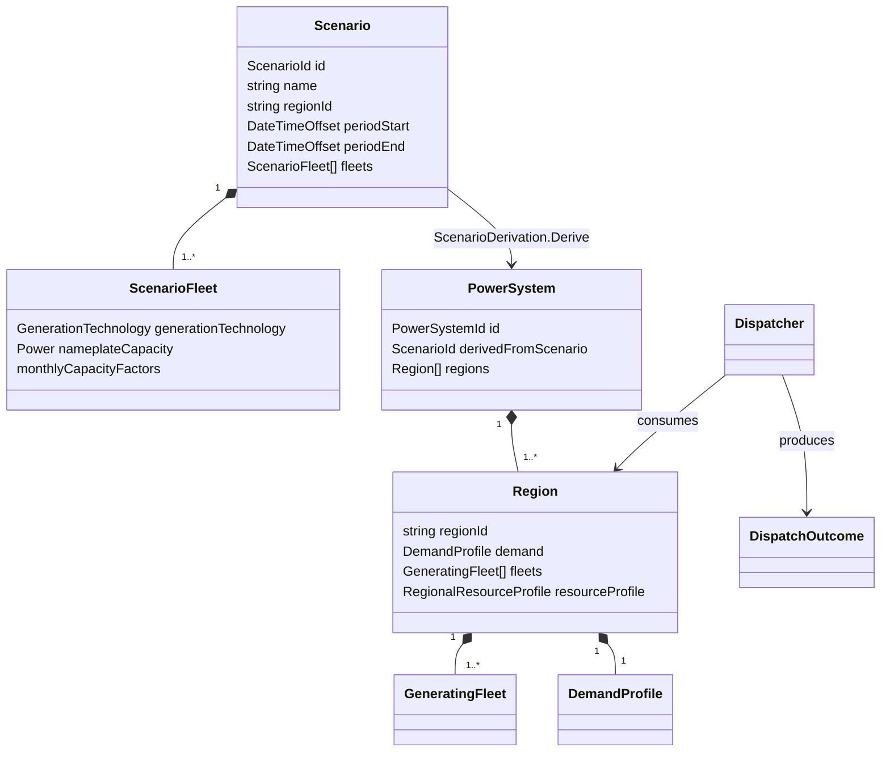

# Domain model

This document tracks the domain types currently implemented in `NEM.Model`.
It describes code that exists now; future concepts belong here only when their
domain types and invariants are implemented.



## Ownership boundaries

- `Scenario` is the aggregate root for scenario intent. It validates identity,
  NEM-time period bounds, target region, and fleet plans.
- `ScenarioDerivation` is a pure domain service that realises a `PowerSystem`
  from scenario intent and aligned demand/resources.
- `PowerSystem` is the realised grid aggregate and cites its source scenario by
  `ScenarioId`. It owns one or more `Region` aggregates.
- `Dispatcher` remains scenario-blind. It consumes a realised `Region` and
  produces a `DispatchOutcome`.
- Exported run results cite scenario and power-system identities rather than
  serialising the domain object graph.

## Input provenance

Demand and weather paths are CLI configuration used to locate inputs; they are
not part of `Scenario` identity. A result records the filename, input schema
version, and SHA-256 digest of the exact bytes parsed for each input. The digest
is the reproducibility boundary when a configured path is later overwritten.

The upstream demand archive names remain descriptive provenance from the demand
artifact. They do not replace the demand artifact digest.

## Time and units

Scenario periods and model series use fixed NEM market time (UTC+10). Result
generation timestamps use UTC because they describe when an artifact was
created; seeing `+10:00` period bounds and a `+00:00` generated timestamp in the
same result is intentional.

Flow series are interval-average MW and integrate to MWh through
`FlowSeries.Integrate()`. The dispatch invariant is:

```text
generation + discharge + imports + unserved
    = demand + charge + exports + curtailment
```

The current single-region, no-storage model sets charge, discharge, imports,
and exports to zero. Result JSON exports generation delivered to load
(`generation - curtailment`), for which the current reduced identity is:

```text
delivered generation + unserved = demand
```

Reliability reports both unserved energy (USE) as a percentage of demand and
hours served. USE percentage is the binding reliability measure; hours served
is diagnostic and must not be compared with an energy-based reliability target.

## Storage

`StorageFleet` is an immutable storage-archetype configuration and an interval
state-transition operation. A positive requested flow discharges to the grid;
a negative requested flow charges from the grid. Its state of charge is always
validated within zero and its configured energy capacity.

Each fleet owns its energy and power capacities; its duration is derived as MWh
divided by MW. The same storage abstraction supports battery and pumped-hydro
fleets with different fleet capacities. Both limits bind each interval.

The technology profile supplies one round-trip efficiency. It is applied once
while charging: input MWh multiplied by efficiency becomes stored MWh.
Discharge removes and delivers stored MWh one-for-one, so a charge-discharge
cycle loses `(1 - efficiency)` of the grid energy used to charge it. Round-trip
efficiency is constrained to the inclusive range from zero to one.